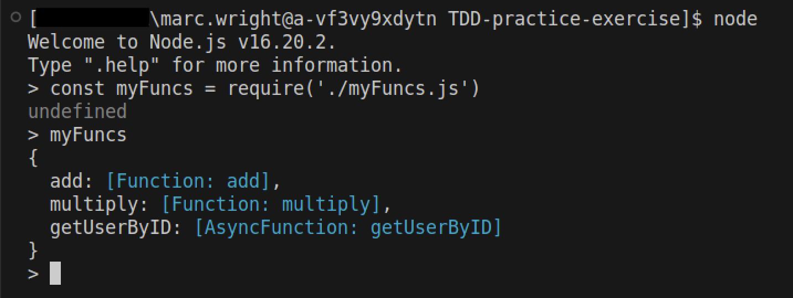

## Unit Testing With Jest

## Set-up

1. `cd starter`
1. Run `npm i jest --save-dev` in your `starter` folder.
1. Create a `test` folder at the root of your `starter` folder.
1. Jest will look for files that have `.spec` in them inside a folder named test or tests. In your `test` folder, create a file called `myFuncs.spec.js`. This is where we will test the code in `myFuncs.js`

<br>

## Manually test `myFuncs.js`

You can probably read through this code an tel what it's doing. However, to check this code in a `node` environment you can try the following.

1. Open a new Terminal window or tab and type `node`.

   

2. We'll import `myFuncs.js` using `require` and assign it to a variable named `const myFuncs`. Now we'll be able to manually test the functions in the file.

   

3. For example, to test the `add` function we could do this:

   

<br>

## Write tests using Jest in `test/myFuncs.spec.js`

1. First, import the function that you want to test.

   ```js
   const { add } = require("../myFuncs");
   ```

1. Next, we'll create a `describe` block for our series of `myFunc.js` tests. The describe block is a way to create specific containers for your test:

   ```js
   describe("myFuncs.js tests", () => {});
   ```

1. We'll start with a test for the `add` function to confirm if it actually exists.

   ```js
   test("Does module have add", () => {
     expect(add).toBeDefined();
   });
   ```

1. Open your Terminal and run `npm run test`. The test suite will run and you should see the following.

   

1. Next, let's add a test to check the functionality of `add()`.

   ```js
   test("myFuncs#add when 3 + 7 should return 10", () => {
     const actual = add(3, 7);
     const expected = 10;
     expect(actual).toEqual(expected);
   });
   ```

   

<br>

## YOU DO

1. Create a 3rd test case for the `add` function.
1. In `myFuncs.js` create function called `multiply` that returns the product of two integers.
1. Create a test case to confirm if the `multiply` function exists.
1. Create 2 test cases for `multiply` using `actual/expected`.

<br>

## Write tests and code to return a user in `test/myFuncs.spec.js`

   
1. We want to write the test before the code. In `myFuncs.spec.js` file, create a test case to confirm that the function is defined. This test should fail initially.

   ```js
   test("Does module have getUserByID", () => {
     expect(getUserByID).toBeDefined();
   });
   ```

1. Next, in `myFuncs.js` we'll add a `getUserByID` function declaration to make the test pass. **Make sure to export the function at the bottom of the file.**

   ```js
   const getUserByID = () => {};
   ```

1. Next, we'll create a test to return the Mehgan user object when we pass an argument of `2` to the function. Make sure to import the function at the top of the `myFuncs.spec.js` file.

   ```js
   test("myFuncs#getUserByID when passed userID 2 will return Mehgan", async () => {
     const actual = await getUserByID(2);
     const expected = {
       name: "Mehgan",
       age: 72,
       state: "IA",
     };
     expect(actual).toEqual(expected);
   });
   ```

1. In the `module` folder there is a `userAPI` file. This file contains some hard-coded fake user data. We need to import it at the top of our `myFuncs.js` file.

   ```js
   const { getUser } = require("./module/userAPI");
   ```
 
1. Finally, in `myFuncs.js` we'll add a simple function that will return a user based on the argument we pass in. **Make sure to export the function at the bottom of the file.**

   ```js
   const getUserByID = async (userId) => {
     return await getUser(userId);
   };
   ```
